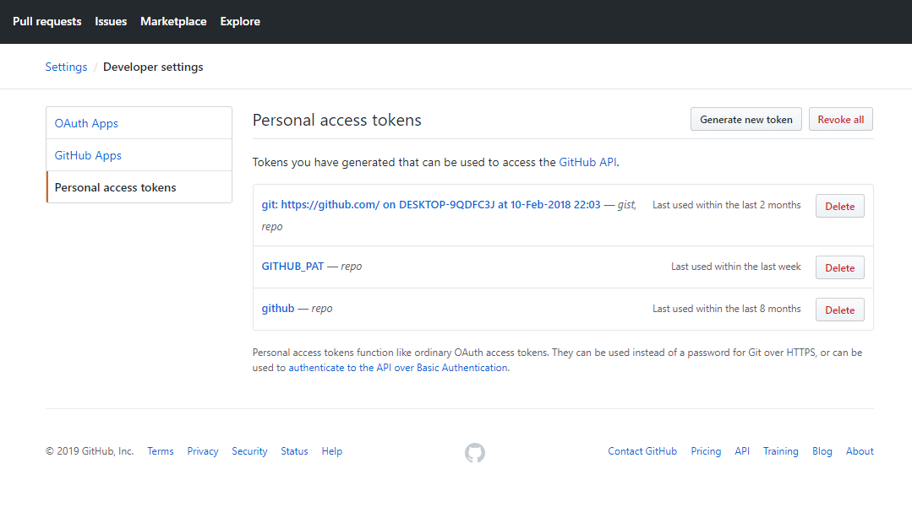
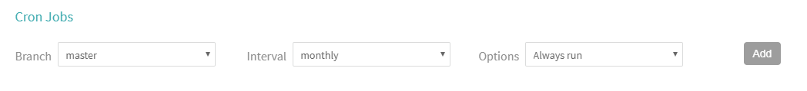
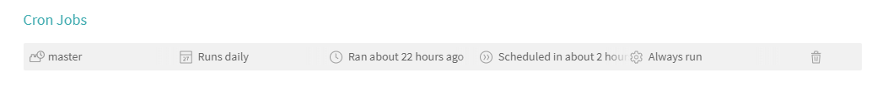

```{r setup, include=FALSE}
knitr::opts_chunk$set(echo = TRUE, eval = FALSE)
```

## What is really the most important aspect of being a Statistcian?

```{r, echo = FALSE, eval = TRUE, out.width = '50%', fig.align = 'center'}

```

---
## Required Reasorces

In order to build a data package for this presentation I needed the following:

- GitHub ([BenBarnard/dataPkgBuild](https://github.com/BenBarnard/dataPkgBuild)),
- [TravisCI](https://docs.travis-ci.com/user/for-beginners/),
- Data access ([Bureau of Labor Statistics](https://www.bls.gov/developers/api_signature.htm) and [Data.gov](https://www.data.gov/)), 
- [drat](http://dirk.eddelbuettel.com/code/drat.html), and
- other packages as needed for data sourcing.

---
## Data package Build

Easy route:

- fork repository ([BenBarnard/dataPkgBuild](https://github.com/BenBarnard/dataPkgBuild))
- change r scripts as necessary to source data

Harder Route:

- setup package skeleton
- create "docs" or another folder to be added to .Rbuildignore
- create R scripts to source data to be added to .Rbuildignore
- create R script to deploy drat to be added to .Rbuildignore
- create R script to handle custom build options to be added to .Rbuildignore
- create .travis.yml


---
## Creating Package Skeleton

Setup GitHub repository by [prefered method](https://github.com/new).

```{r}
library(usethis)

create_package(getwd())
use_travis()
```

---
## [.travis.yml](https://github.com/BenBarnard/dataPkgBuild/blob/master/.travis.yml)

```{yml}
language: R
sudo: false
script:
 - Rscript version_change.R
 - Rscript data_build.R
 - R CMD build .
 - R CMD INSTALL -l . --build .
 - R CMD check *tar.gz
cache: packages
after_success:
 - Rscript web_deploy.R
 - Rscript drat_deploy.R
 - Rscript shiny_deploy.R
deploy:
  provider: pages
  skip_cleanup: true
  github_token: $GITHUB_PAT
  on:
    branch: master
  local-dir: docs
  target-branch: gh-pages
notifications:
  email:
    - ben_barnard@outlook.com
  on_success: always
  on_failure: always
```

---
## GITHUB_PAT?
[
```{r, echo = FALSE, eval = TRUE, out.width = '85%', fig.align = 'center'}

```
](https://github.com/settings/tokens)

---
## [version_change.R](https://github.com/BenBarnard/dataPkgBuild/blob/master/version_change.R)

```{r}
d <- read.dcf('DESCRIPTION')
d[1,3] <- gsub('-', '.', Sys.Date())
write.dcf(d, 'DESCRIPTION')
```


---
## Package Dependecies in [data_build.R](https://github.com/BenBarnard/dataPkgBuild/blob/master/data_build.R)

```{r}
install.packages(c("DBI", "nycflights13", "dplyr",
                   "RSQLite", "usethis", "httr",
                   "rjson", "tibble", "purrr",
                   "dbplyr"))

library(DBI)
library(nycflights13)
library(dplyr)
library(RSQLite)
library(usethis)
library(httr)
library(rjson)
library(tibble)
library(purrr)
```

---
## R script to build data from api

```{r}
payload <- list(
  'seriesid' = c('LAUCN040010000000005', 'LAUCN040010000000006'),
  'startyear' = 2010,
  'endyear' = 2012,
  'catalog' = FALSE,
  'calculations' = TRUE,
  'annualaverage' = TRUE)

response <- POST(
  url = "https://api.bls.gov/publicAPI/v1/timeseries/data/",
  body = toJSON(payload),
  content_type_json())

json <- fromJSON(rawToChar(response$content))
```


---
## R script to build data from api

```{r}
bls_test_df <- map_dfr(json$Results$series, function(x){
  cbind(tibble(seriesID = x$seriesID),
        map_dfr(x$data, function(y){
          tibble(year = y$year,
                 period = y$period,
                 periodName = y$periodName,
                 value = y$value,
                 footnotes = y$footnotes)
        })
  )
})

use_data(bls_test_df, overwrite = TRUE)
```


---
## R script to build from database

```{r}
con <- DBI::dbConnect(RSQLite::SQLite(), path = ":memory:")

copy_to(con, nycflights13::flights, "flights",
        temporary = FALSE,
        indexes = list(
          c("year", "month", "day"),
          "carrier",
          "tailnum",
          "dest"
        )
)

flights_db <- tbl(con, "flights")
```


---
## R script to build from database

```{r}
flights_sqldb_df <- collect(summarise(group_by(flights_db, dest),
                                      delay = mean(dep_time, 
                                                   na.rm = TRUE)))

use_data(flights_sqldb_df, overwrite = TRUE)
```


---
## [drat_deploy.R](https://github.com/BenBarnard/dataPkgBuild/blob/master/drat_deploy.R)

```{r}
install.packages('drat')
date <- gsub('-', '.', Sys.Date())
pkg <- paste0('dataPkgBuild_', date, '.tar.gz')
binary <- paste0('dataPkgBuild_', date, '.zip')
drat::insertPackage(pkg, repodir = 'docs')
drat::insertPackage(binary, repodir = 'docs')
```

---
## [.Rbuildignore](https://github.com/BenBarnard/dataPkgBuild/blob/master/.Rbuildignore)

I really don't want any annoying messages. The .Rbuildignore should include the directory and files:

```{.Rbuildignore}
^\.travis\.yml$
^dataPkgBuild\.Rproj$
^\.Rproj\.user$
^docs
drat_deploy.R
version_change.R
data_build.R
shiny_deploy.R
web_deploy.R
^presentation
```

---
## Email notifications

Sometimes we don't want to tell people the new data is up (or talk to anybody at all).

```{yml}
notifications:
  email:
    - ben_barnard@outlook.com
  on_success: always
  on_failure: always
```

([yml](https://github.com/BenBarnard/dataPkgBuild/blob/master/.travis.yml))

---
## Setting Cron Jobs

Before:
```{r, echo = FALSE, eval = TRUE, out.width = '100%'}

```


After:
```{r, echo = FALSE, eval = TRUE, out.width = '100%'}

```

([travis settings](https://travis-ci.org/BenBarnard/dataPkgBuild/settings))

---
## [Shiny Apps](https://shiny.rstudio.com/)

Shiny is an R package that makes it easy to build interactive web apps straight from R. You can host standalone apps on a webpage or embed them in R Markdown documents or build dashboards. You can also extend your Shiny apps with CSS themes, htmlwidgets, and JavaScript actions.

---
## [server.R](https://github.com/BenBarnard/dataPkgBuild/inst/server.R)

```{r}
library("dataPkgBuild")

shinyServer(
  function(input, output) {

    output$main_plot <- renderPlot({

      hist(flights_sqldb_df$delay,
           probability = TRUE,
           breaks = as.numeric(input$n_breaks),
           xlab = "Delay (minutes)",
           main = "Departure delay duration")

      if (input$individual_obs) {
        rug(flights_sqldb_df$delay)
      }

      if (input$density) {
        dens <- density(flights_sqldb_df$delay,
                        adjust = input$bw_adjust,
                        na.rm = TRUE)
        lines(dens, col = "blue")
      }})})
```

---
## [ui.R](https://github.com/BenBarnard/dataPkgBuild/inst/ui.R)

```{r}
shinyUI(
  bootstrapPage(

    selectInput(inputId = "n_breaks",
                label = "Number of bins in histogram (approximate):",
                choices = c(10, 20, 35, 50),
                selected = 20),

    checkboxInput(inputId = "individual_obs",
                  label = strong("Show individual observations"),
                  value = FALSE),

    checkboxInput(inputId = "density",
                  label = strong("Show density estimate"),
                  value = FALSE),

    plotOutput(outputId = "main_plot", height = "300px"),

    conditionalPanel(condition = "input.density == true",
                     sliderInput(inputId = "bw_adjust",
                                 label = "Bandwidth adjustment:",
                                 min = 0.2, max = 2, value = 1, step = 0.2)
    )))

```

---
## [shiny_deploy.R](https://github.com/BenBarnard/dataPkgBuild/blob/master/shiny_deploy.R)

```{r}
options(repos = c("MyRepo"="https://benbarnard.github.io/dataPkgBuild",
                  "CRAN"="https://cran.rstudio.org"))

install.packages(c('rsconnect', 'shiny', "dataPkgBuild"))

rsconnect::setAccountInfo(name='ben-barnard',
                          token=Sys.getenv("shiny_token"),
                          secret=Sys.getenv("shiny_secret"))
library(rsconnect)
rsconnect::deployApp('inst/flightsApp',
                     forceUpdate = TRUE,
                     launch.browser = FALSE)
```

---
## shinyapps.io

[
```{r, echo = FALSE, eval = TRUE, out.width = '85%', fig.align = 'center'}

```
](https://www.shinyapps.io/admin/#/dashboard)

---
## [web_deploy.R](https://github.com/BenBarnard/dataPkgBuild/blob/master/web_deploy.R)

```{r}
install.packages(c("rmarkdown", "knitr", "xaringan"))

rmarkdown::render(input = "presentation/index.Rmd", output_dir = "docs")

imgs <- list.files("presentation", pattern = ".*\\.((png)|(jpg))")

lapply(imgs, function(x){
  file.copy(from = paste0("presentation/", x),
            to = paste0("docs/", x))
})

```


---
## Other Options (Extensions?)

- [Jenkins](https://jenkins.io/doc/)
- [ansible](https://www.ansible.com/overview/how-ansible-works)
- [Docker](https://www.docker.com/resources/what-container)
- [testhat](https://testthat.r-lib.org/)

---
## 

```{r, echo = FALSE, eval = TRUE, out.width = '50%', fig.align = 'center'}

```


